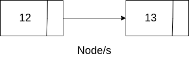
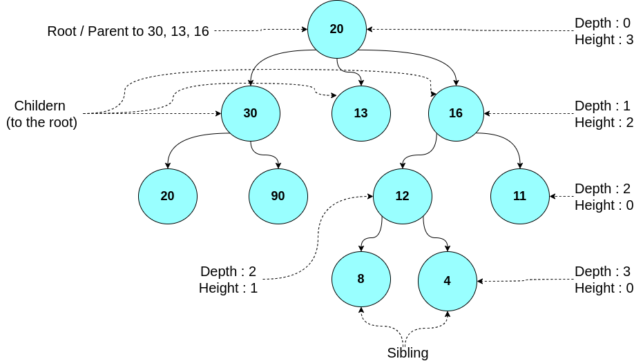
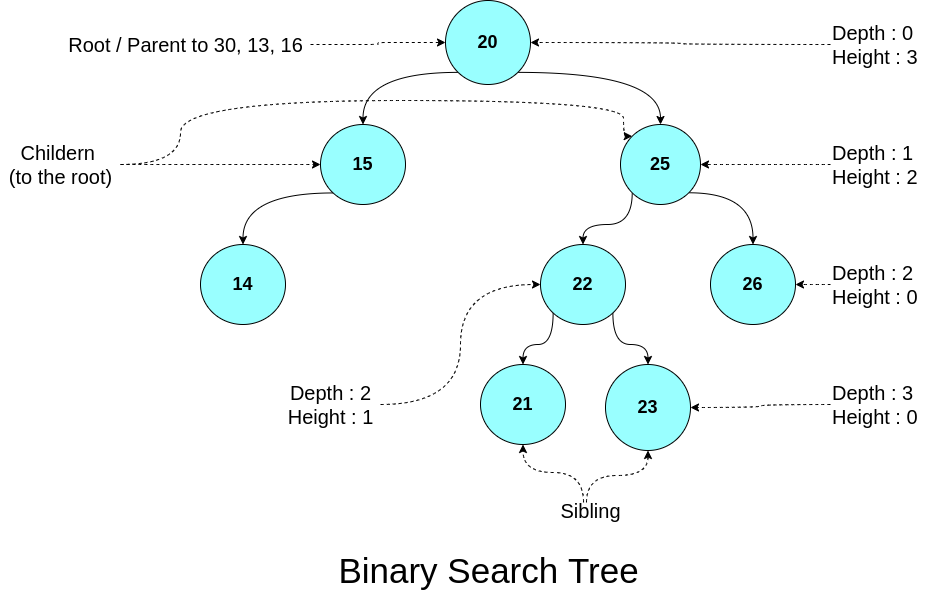
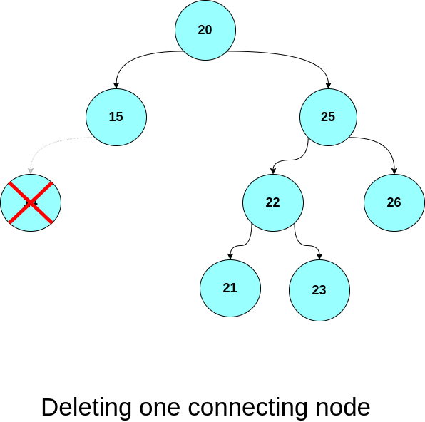
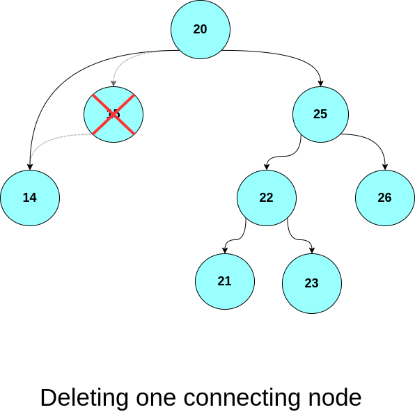
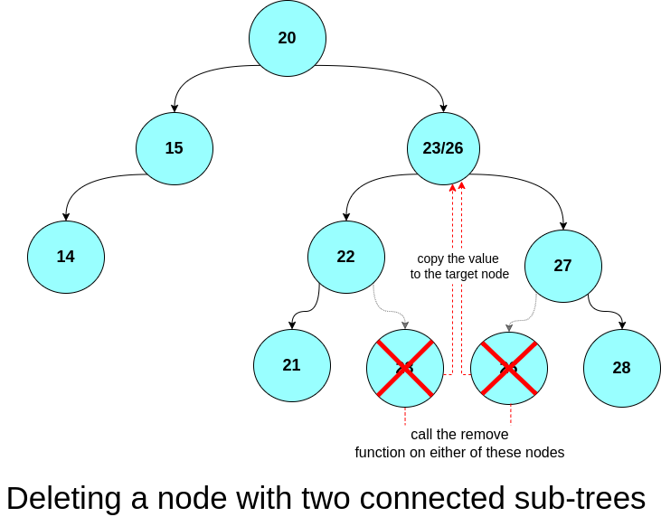

# Introduction
Trees are a unique data structure which represent a hierarchical set of data, as opposed to linear data structure like Arrays and linked list. 
think about it we can't represent data without representing the relation between them, for example a family tree can't be represented as a linked list or an array 
## Some Terminology 
Trees consist of nodes, each node must has two component the first being a value and the second being a pointer/s to other nodes.



Each node has something of a title that describe its relation with other nodes. 

Here is the definition of each term 
  - Root : Upward most node ⬆️
  - Parent : A node with children 👨‍👦
  - Child : A node with Parent 🧒
  - Siblings : Nodes with the same parent 👨‍👩‍👧‍👧
  - Depth : distance traveled to reach this node from the root 
  -  Height : the distance to reach to deepest node from current node


  



## Type of Trees 
There are several type and each has a different purpose
Today we'll discuss the the implementation properties of these trees
1. Binary search tree 
2. AVL Trees 
3. Red Black trees 

### Binary search trees 
Binary search tree are Tree-based data structure, where each node connect to two other nodes, for each node the left child must has a either a smaller or equal value to its parent, and subsequently the right child must has a larger value than its parent. 
This property makes binary search possible and thus reduces the complexity for searching in that Tree  


<br>

|     OP/DS     |  Array   |   sorted Array    | linked list | Binary Search Trees |
|:-------------:|:--------:|:-----------------:|:-----------:|:-------------------:|
| **Searching** | **O($N$)** | **O($log(n)$)** |  **O($N$)**   | **O($log(n)$)\*** |
|  **Adding**   | **O(1)** |     **O($N$)**      |  **O(1)**   | **O($log(n)$)\*** |
| **Deleting**  | **O(1)** |     **O($N$)**      |  **O(1)**   |     **O($H$)\****     |  

\* If the tree has a degenerate form then the Big O Notation for every operation is **O(N)**
\** H is the height of the tree

#### Implementation 
any implementation of any binary tree must consider the following actions/function and all of these actions share one thing in particular they're all recursive function
- 🖊️ Inserting a node 🖊️ 
- ❌ Deleting a node ❌	
- 🔍️ Searching for a node 🔍️

##### 🖊️ Inserting a node 🖊️  
values to be inserted must finds their correct position in the binary search tree so that the tree maintains its functionality. 
so to do that we have to do two things 
1. Searching for an appropriate spot
2. insert the node 


Searching is straight foreword as binary search trees are predictable due to their structure previously explained, and to implement search we'll be using recursion
``` cpp
Node *BST::insert(Node *&root, int x)
{
	if (root == nullptr)
	{
		Node *node = createNode(x);
		root = node;
	}
	else if (root->value >= x)
	{
		root->left = insert(root->left, x);
	}
	else if (root->value < x)
	{
		root->right = insert(root->right, x);
	}
		return root;
}

```


##### ❌ Deleting a node ❌
deletion is much more complicated, deletion requires us to consider what will occur for the sub-tree connected the target node. 
the target node could be connected to 
1. no other node (a leaf) 
in which case that node can be deleted and parent's pointer reset with no farther consequences

	
2. connected one sub-tree
in that case we must reset the parent's pointer so that it connects to that sub-tree and then delete the node. 


3. connected to two other sub-trees 
in that case, we must search for a replacement for our node which will be either : 
	-  The left most node of the right sub-tree 
	- The right most node of the left sub-tree 
and then we must call the remove function to delete the replacement.


##### 🔎 Searching for a node 
to search for a node we have perform a binary search where we ignore the any side of the node which is either bigger or smaller to the value we are searching for begining form the root, we have three cases 
 1. an empty tree // simply return a nullptr
 2. found // return it !
 3. still not found  // keep going
 4. leaf // return nullptr

```cpp
const Node *BST::search(const Node *root, int x)
{
// try and catch blocks in case the value isn't found
	try
	{
	if (root == nullptr)
		return nullptr;
	if (root->value == x)
	{
		const Node *res = root;
		return res;
	}
	else if (x > root->value)
		search(root->right, x);
	else if (x <= root->value)
		search(root->left, x);
	}
	catch (const std::exception &e)
	{
		return nullptr
	}
}
```


[Implementation](https://github.com/Walid-Kh/IEEE-CUSB/blob/master/lecture-1/binarySearchTree.cpp)